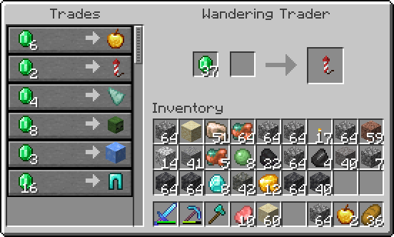
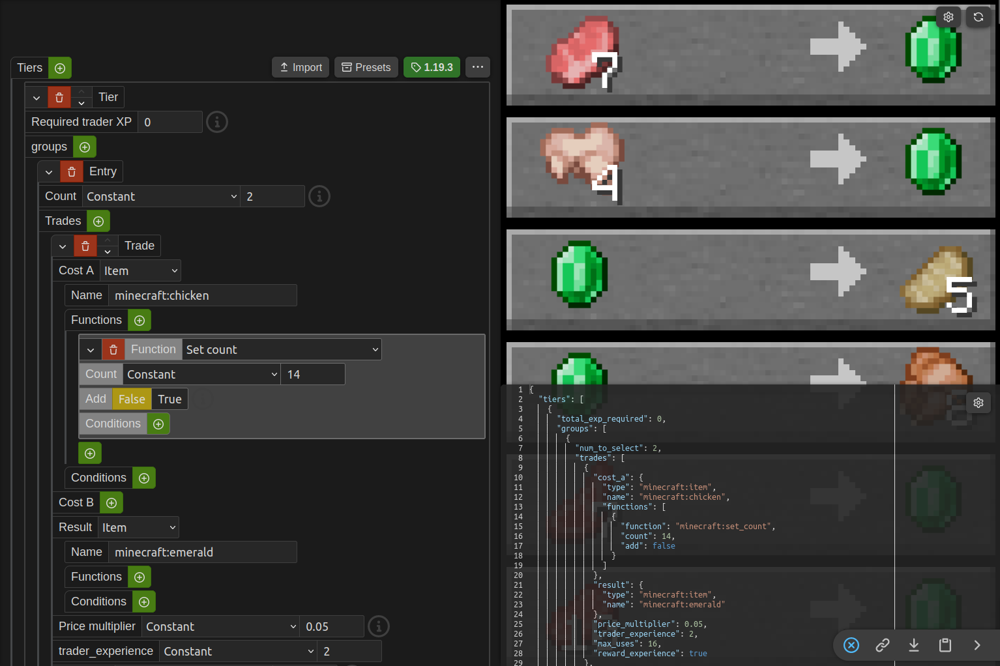
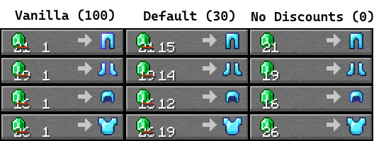

# VillagerConfig
VillagerConfig is an advanced fabric mod for customizing villagers. It allows loading custom villager trades using
datapacks, customizing trade behavior, and more...

## Features
### Custom trades
One of VillagerConfig's most powerful features are the custom trades. Custom trades allows mod-pack creators, server owners 
and others to completely customize wandering trader and villager trades! If you want to create your own custom datapack, 
make sure to check out the [wiki](https://github.com/DrexHD/VillagerConfig/wiki/Get-started)!

### Online generator
Setting up custom trades can be quite annoying, so a custom online generator has been created to help creating datapack
files with a convenient **graphical user interface** and an **instant preview**!
Check it out [here](https://villagerconfig.vercel.app/villagerconfig/?preset=butcher)!

### Discounts
You can configure a *maximum* and *minimum* **discount** a villager can put on their trades.

### Old trade mechanics
There is a config option that allows to enable trade mechanics, that replicate the [trade behaviour before the 1.14 village and pillage update](https://minecraft.wiki/w/Trading/Before_Village_%26_Pillage#Mechanics).

### Other
There are several other config options available to customize villager behaviour!
#### Trade cycling
Whether villagers trades will change, when their workstation is replaced (and they haven't been traded with)

#### Conversion chance
The chance for a villager to convert to a villager-zombie

#### Infinite trades
Whether villagers need to restock their trades
